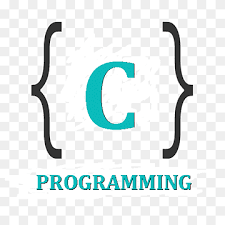
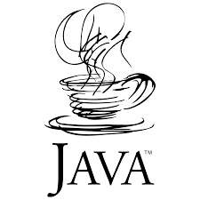

<h1 align="center">Cruz Walter - Full Stack Web Developer</h1>

## Hello People!!! 👋

Soy un desarrollador web Full-Stack, Argentino, nacido en 

 

<h2 align="center">Lenguajes de Programacion:</h2>
 
 

•Javascript
•Java
•C
•Assembler

  </a>

 </a>

 </a>

 </a>

<h2 align="center">Tecnologias y Herramientas:</h2>

•Git
•React
•Redux
•HTML
•CSS
•NodeJs 
•Express
•Postman
•PostgreSQL
•SQLite
•Sequelize
•Babel
•MongoDB
•Mongoose

 

 

 

 

  

 <!-- <h3 align="center" >My Portfolio</h3> 
 
  -->

<h2 align="center">Contact</h2>
 

    
    

  

